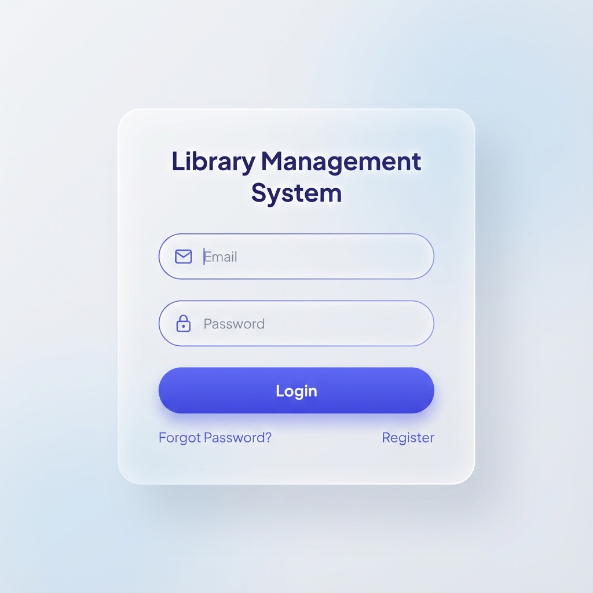
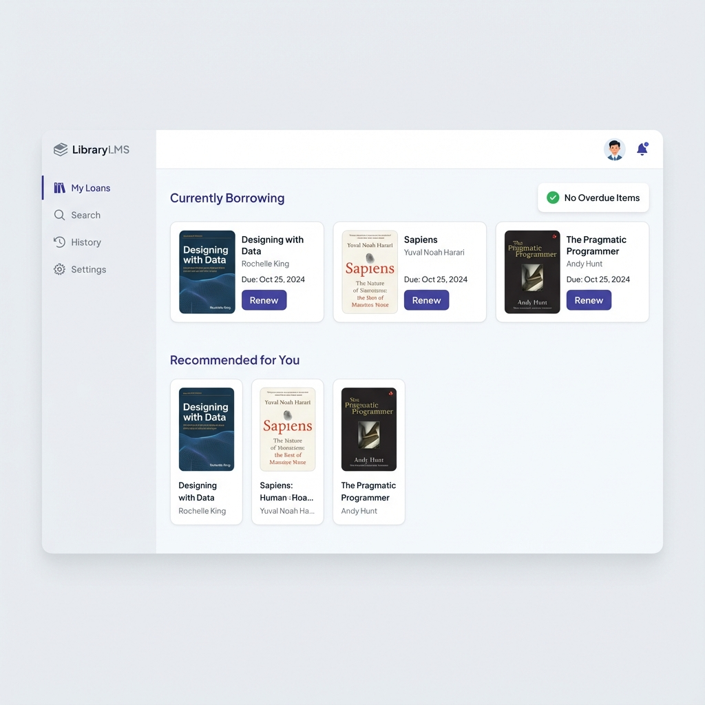
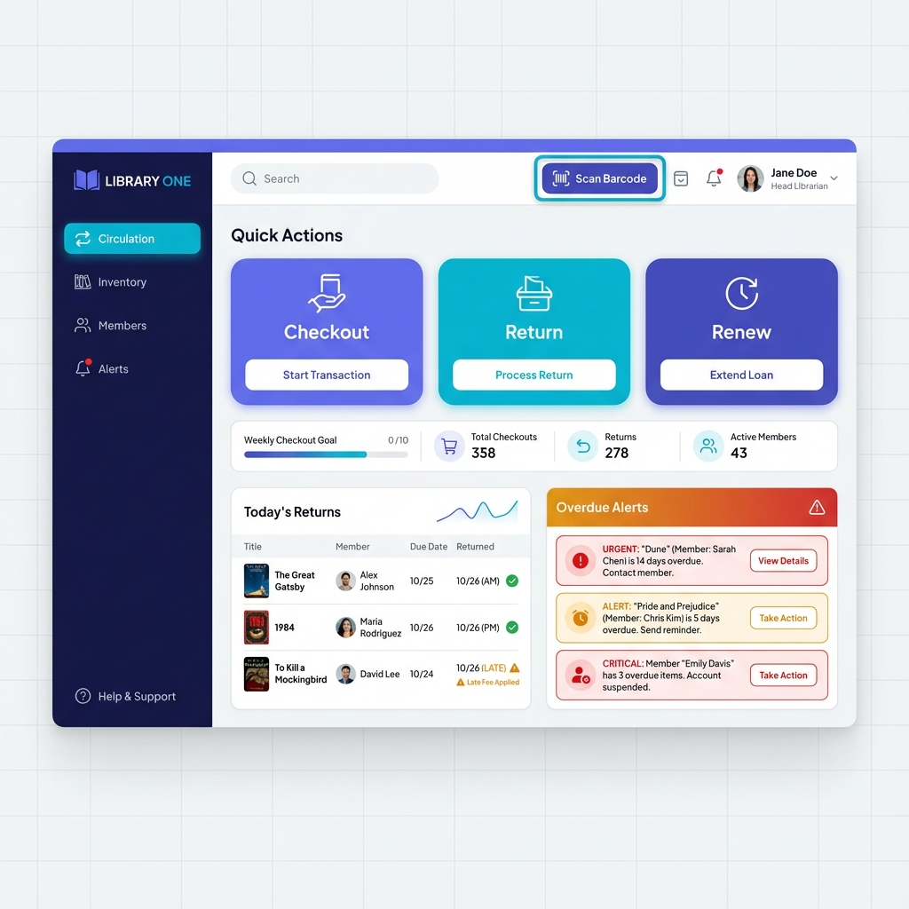

# Library Management System - Complete Project


A comprehensive **Role-Based Access Control (RBAC) library management system** with PostgreSQL database and Node.js/Express REST API backend.

## 🎯 Project Overview

A production-ready library management platform supporting three user roles:
- **Admin**: System management, analytics, user oversight
- **Librarian**: Daily operations, inventory management, circulation
- **Librarian**: Daily operations, inventory management, circulation
- **Student**: Self-service borrowing, account management, book search

## 📸 Screenshots

| Login Screen | Student Dashboard |
|:---:|:---:|
|  |  |
| **Admin Dashboard** | **Librarian Dashboard** |
|  |  |

## 📁 Project Structure

```
library-management/
│
├── backend/                        # Node.js/Express REST API
│   ├── src/
│   │   ├── config/                # Environment & database configuration
│   │   ├── controllers/           # Request handlers for each role
│   │   ├── middleware/            # Auth & role-based access control
│   │   ├── routes/                # API endpoint definitions
│   │   ├── services/              # Business logic & utilities
│   │   ├── utils/                 # Helper functions
│   │   ├── app.js                 # Express app setup
│   │   └── server.js              # Server entry point
│   ├── tests/                     # E2E tests (Playwright)
│   ├── .env.example               # Environment template
│   ├── package.json               # Dependencies & scripts
│   └── README.md                  # Backend documentation
│
├── db/                             # PostgreSQL database layer
│   ├── schema/                    # Table definitions & initialization
│   │   ├── 00_init_schema.sql     # Core tables (users, books, loans, fees)
│   │   ├── 01_constraints_indexes.sql  # Constraints & indexes
│   │   ├── 02_users_and_auth.sql  # User authentication setup
│   │   └── 07_fuzzy_search_indexes.sql # Search optimization
│   ├── procedures/                # Stored procedures
│   │   ├── checkout_and_return.sql
│   │   └── overdue_and_fees.sql
│   ├── functions/                 # SQL functions
│   │   └── fn_verify_user_credentials.sql
│   ├── admin/                     # Admin-specific SQL
│   │   ├── admin_functions.sql
│   │   └── admin_views.sql
│   ├── views/                     # Database views for analytics
│   │   ├── analytics_views.sql
│   │   └── vw_overdue_loans.sql
│   ├── reports/                   # Report generation queries
│   │   └── inventory_and_member_reports.sql
│   └── seeds/                     # Sample data for testing
│       └── sample_data.sql
│
├── frontend/                       # React Frontend Application
│   ├── src/
│   │   ├── api/                   # Axios instances & API calls
│   │   ├── components/            # Reusable UI components
│   │   ├── pages/                 # Route components (Admin, Librarian, Student)
│   │   ├── store/                 # Zustand state management
│   │   ├── theme/                 # MUI theme configuration
│   │   ├── routes/                # Role-based routing
│   │   ├── App.jsx                # Main application component
│   │   └── main.jsx               # Application entry point
│   ├── public/                    # Static assets
│   ├── index.html                 # HTML entry point
│   ├── vite.config.js             # Vite configuration
│   └── package.json               # Frontend dependencies
│
├── .vscode/                        # VS Code settings
├── README.md                       # This file
└── LICENSE

```

## 🚀 Quick Start

### Prerequisites

- **PostgreSQL** 12 or higher
- **Node.js** 14+ and npm
- **Git** (optional)

### 1️⃣ Database Setup

Initialize PostgreSQL database:

```bash
# Connect to PostgreSQL
psql -U postgres

# Create database
CREATE DATABASE library_db;

# Run initialization scripts (in order)
psql -U postgres -d library_db -f db/schema/00_init_schema.sql
psql -U postgres -d library_db -f db/schema/01_constraints_indexes.sql
psql -U postgres -d library_db -f db/schema/02_users_and_auth.sql
psql -U postgres -d library_db -f db/schema/07_fuzzy_search_indexes.sql

# Load stored procedures and functions
psql -U postgres -d library_db -f db/procedures/checkout_and_return.sql
psql -U postgres -d library_db -f db/procedures/overdue_and_fees.sql
psql -U postgres -d library_db -f db/functions/fn_verify_user_credentials.sql

# Load admin functions and views
psql -U postgres -d library_db -f db/admin/admin_functions.sql
psql -U postgres -d library_db -f db/admin/admin_views.sql

# Load additional views and reports
psql -U postgres -d library_db -f db/views/analytics_views.sql
psql -U postgres -d library_db -f db/views/vw_overdue_loans.sql
psql -U postgres -d library_db -f db/reports/inventory_and_member_reports.sql

# (Optional) Load sample data
psql -U postgres -d library_db -f db/seeds/sample_data.sql
```

### 2️⃣ Backend Setup

```bash
# Navigate to backend directory
cd backend

# Install dependencies
npm install

# Create environment file
# Create environment file
cp .env.example .env

# Start Backend Server
npm run dev
# Server runs on http://localhost:5000
```

Edit `backend/.env` with your configuration:

```env
PORT=5000
NODE_ENV=development

JWT_SECRET=your-super-secret-jwt-key-here
JWT_EXPIRY=24h

DB_HOST=localhost
DB_PORT=5432
DB_NAME=library_db
DB_USER=postgres
DB_PASSWORD=your_postgres_password
DB_SCHEMA=library_app
```

### 3️⃣ Frontend Setup

```bash
# Navigate to frontend directory
cd frontend

# Install dependencies
npm install

# Start development server
npm run dev
# Application runs on http://localhost:5173
```

## 📖 API Documentation

### Authentication Endpoints
- `POST /api/auth/login` - User login
- `POST /api/auth/register` - User registration

### Admin Routes (`/api/admin/*`)
- User management
- System analytics
- Configuration management

### Librarian Routes (`/api/librarian/*`)
- Inventory management
- Circulation operations
- Member management

### Student Routes (`/api/student/*`)
- My borrowing history
- Available books
- Account settings
- Book renewals

### Circulation Routes (`/api/circulation/*`)
- Checkout books
- Return books
- Manage renewals
- Track overdue items

### Reports Routes (`/api/reports/*`)
- Analytics dashboard
- Overdue tracking
- Inventory reports
- Member statistics

### Search Routes (`/api/search/*`)
- Global book search
- Advanced filtering

## 🗄️ Database Schema

### Core Tables

| Table | Purpose |
|-------|---------|
| `users` | User accounts with roles (Admin, Librarian, Student) |
| `books` | Library inventory with metadata |
| `loans` | Book borrowing transactions |
| `fees` | Fine/penalty tracking system |

### Key Features

✅ Fuzzy search indexes for improved book discovery  
✅ Stored procedures for complex transactions  
✅ Database views for analytics and reporting  
✅ User credential verification functions  
✅ Automated overdue tracking  

## 🧪 Testing

### Backend Tests

```bash
cd backend

# Unit & integration tests
npm test

# E2E tests with Playwright
npm run test:e2e

# ESLint code quality
npm run lint
```

## 🔒 Security Features

- JWT-based authentication with expiration
- Password hashing with bcrypt
- Role-based middleware authorization
- Input validation and sanitization
- CORS protection
- Helmet security headers
- SQL injection prevention (parameterized queries)

## 📝 Development Commands

### Backend

```bash
cd backend

npm run dev       # Development server with nodemon
npm start         # Production start
npm test          # Run tests
npm run test:e2e  # E2E tests
npm run lint      # ESLint check
```

## 🛠️ Technology Stack

- **Backend**: Node.js, Express.js
- **Frontend**: React.js, Material UI (MUI), Vite, Zustand
- **Database**: PostgreSQL 12+
- **Authentication**: JWT (jsonwebtoken)
- **Security**: bcrypt, Helmet
- **Testing**: Jest, Playwright
- **Code Quality**: ESLint

## 📋 Workflow

### Typical User Flows

**Student Borrowing a Book:**
1. Login with credentials
2. Search for available books
3. Submit checkout request
4. System verifies availability
5. Record loan in database
6. Return capability enabled

**Librarian Processing Return:**
1. Student returns book
2. Scan or enter book ID
3. System calculates any fees
4. Update loan status
5. Calculate due dates for renewal

**Admin Viewing Analytics:**
1. Login as admin
2. Access admin dashboard
3. View inventory reports
4. Monitor member activity
5. Track overdue items and fees

## 📞 Troubleshooting

### Database Connection Issues
- Verify PostgreSQL is running: `psql --version`
- Check `.env` database credentials
- Ensure database exists: `psql -l | grep library_db`

### Port Already in Use
```bash
# Change PORT in .env or find process using port 5000
lsof -i :5000  # macOS/Linux
netstat -ano | findstr :5000  # Windows
```

### Missing Database Tables
- Run initialization scripts again in order
- Check `db/schema/00_init_schema.sql` exists
- Verify `DB_SCHEMA=library_app` in `.env`

## 📄 License

This project is proprietary software for library management systems.

## 👥 Contributing

See `backend/README.md` for detailed backend documentation and contribution guidelines.

---

**Last Updated**: December 2024  
**Version**: 1.0.0
